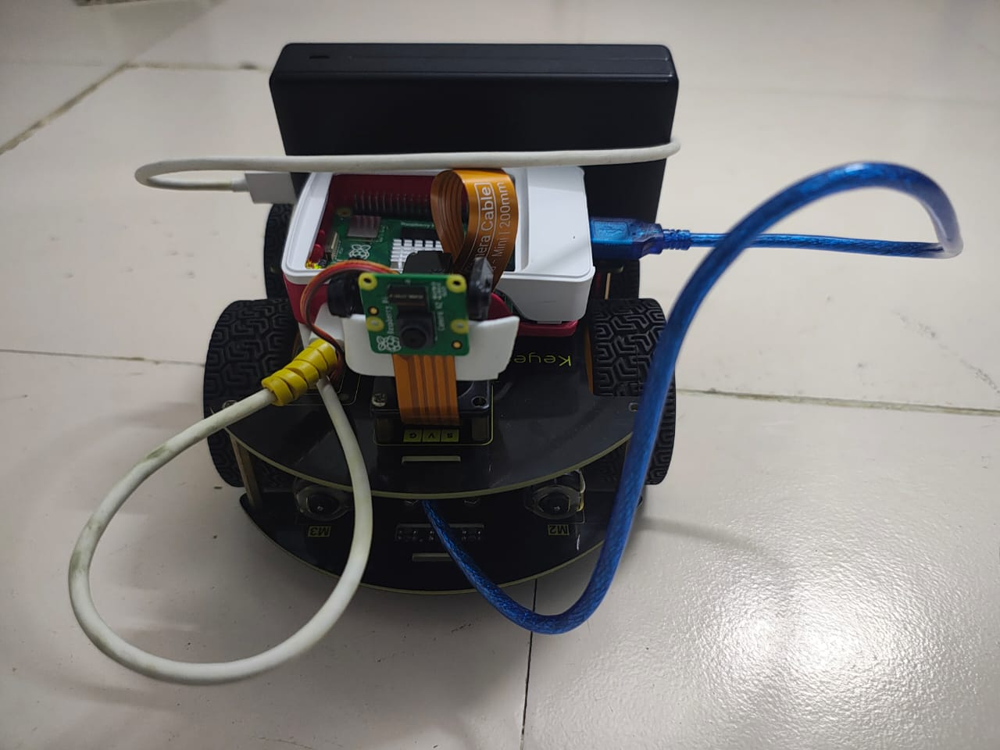
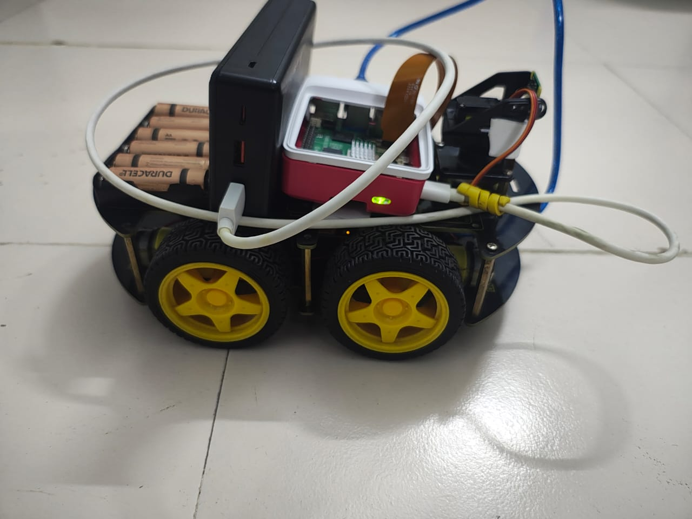
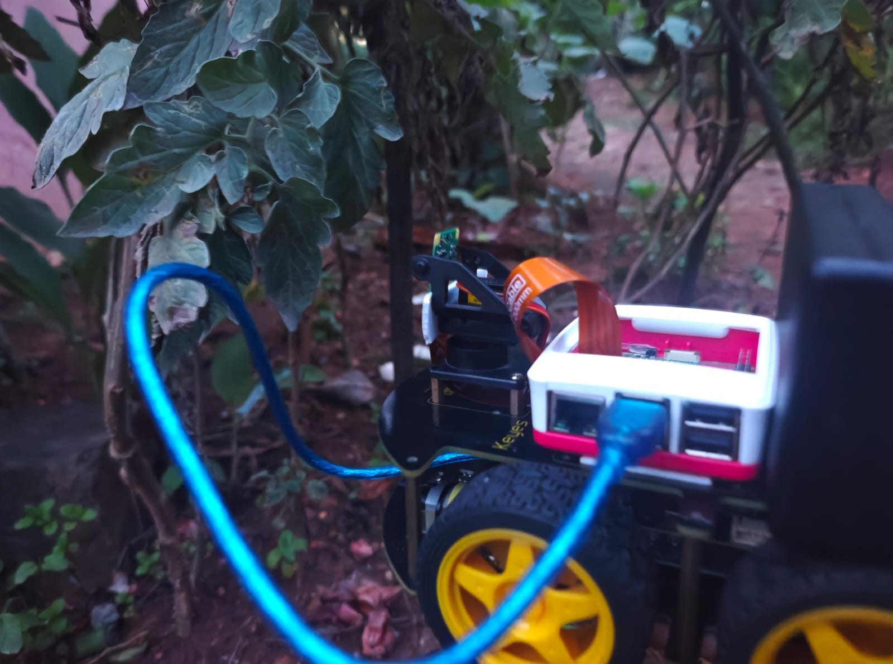
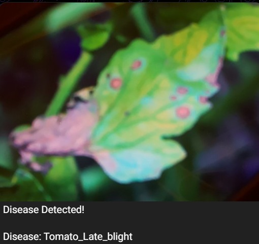
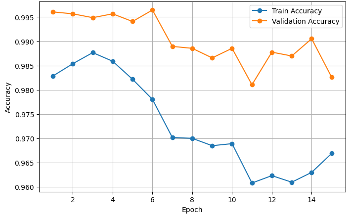
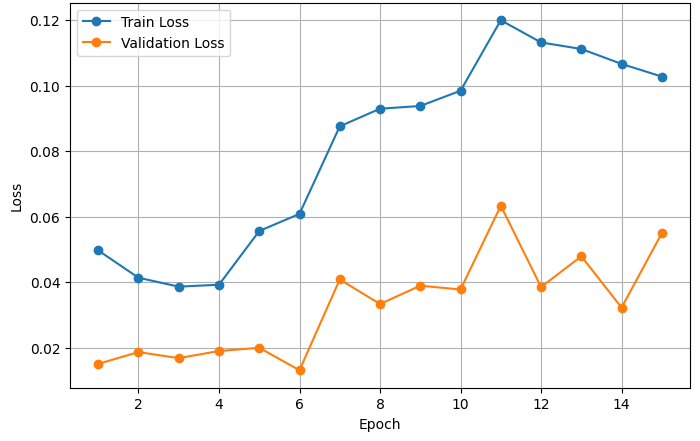
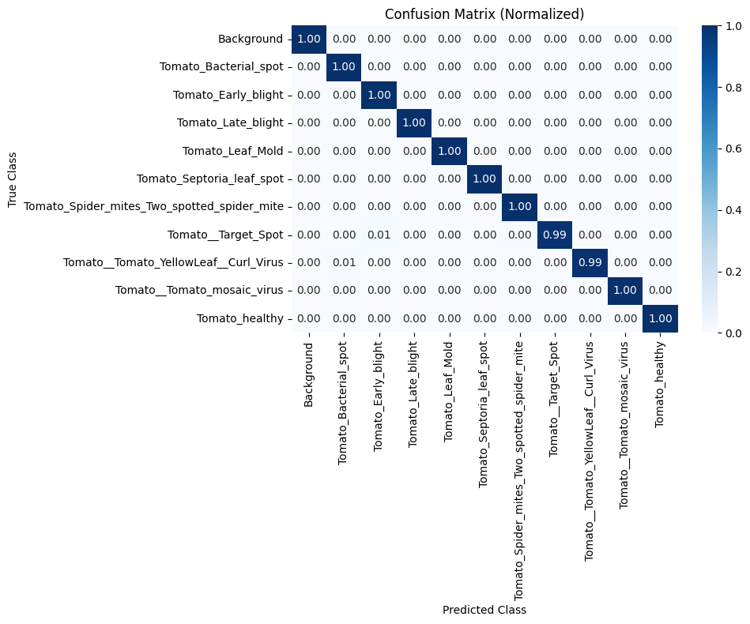

# Plant Disease Detection Rover

Deep learning–based tomato leaf disease classification on a mobile robotic platform for real-time agricultural monitoring.

## Overview

This project presents a low-cost smart agriculture system that combines computer vision, deep learning, and embedded robotics to detect tomato leaf diseases in real time. The system is built around a mobile rover platform powered by Raspberry Pi 5 and a Raspberry Pi Camera Module 2, enabling in-field image capture and on-device inference.

Three lightweight convolutional neural network architectures were evaluated for this task: **EfficientNetB0**, **ResNet18**, and **MobileNetV2**. Based on the best balance between accuracy and deployment suitability, **EfficientNetB0** was selected for rover-side inference. The system is designed to support practical crop monitoring with fast disease recognition and field-oriented usability.

## Key Features

- Real-time tomato leaf disease classification
- Lightweight CNN model comparison for edge deployment
- On-device inference using Raspberry Pi 5
- Rover-based image acquisition for field operation
- Telegram-based disease alert output
- Background-class inclusion to improve robustness
- Organized repository with notebook, assets, paper, and starter source files

## Project Snapshot

### Rover Prototype

<p align="center">
  
  
</p>

### Field Testing

<p align="center">
  
</p>

### Telegram Output Example

<p align="center">
  
</p>

## Model Performance Comparison

The following lightweight architectures were evaluated for tomato leaf disease classification:

| Model | Test Accuracy |
|------|---------------:|
| EfficientNetB0 | **99.73%** |
| ResNet18 | 98.13% |
| MobileNetV2 | 96.35% |

EfficientNetB0 was selected as the final model because it provided the highest classification accuracy while remaining suitable for resource-constrained deployment.

## Training Visualizations

### Accuracy vs Epoch

<p align="center">
  
</p>

### Loss vs Epoch

<p align="center">
  
</p>

### Correlation / Performance Visualization

<p align="center">
  
</p>

## Dataset

The project uses tomato leaf disease images based on the **PlantVillage** dataset, along with an additional background class to improve real-world robustness.

### Dataset Summary

- 16,012 original tomato leaf images
- 10 tomato classes in the base dataset
- 902 added background images
- **Total images used: 16,914**

### Representative Sample Classes

The repository includes sample disease images in:

`data/samples/`

Sample categories include:

- Bacterial Spot
- Early Blight
- Healthy
- Late Blight
- Leaf Mold
- Mosaic Virus
- Septoria Leaf Spot
- Target Spot
- Two-Spotted Spider Mites
- Yellow Leaf Curl

## System Workflow

The end-to-end workflow of the system is as follows:

**Rover Navigation → Image Capture → Raspberry Pi 5 Processing → CNN Inference → Disease Prediction → Telegram Alert**

This workflow supports field-level monitoring and demonstrates how a compact embedded platform can be used for intelligent agricultural assistance.

## Hardware Components

The rover platform is built using:

- Raspberry Pi 5
- Raspberry Pi Camera Module 2
- Rover chassis / mobile platform
- Motor driver and motors
- Battery / portable power source
- Connecting wires and support hardware

## Software Stack

This repository currently reflects a notebook-first experimentation workflow and starter source organization.

### Main tools used

- Python
- PyTorch
- Torchvision
- NumPy
- Matplotlib
- Scikit-learn
- OpenCV
- Jupyter Notebook / Google Colab

## Repository Structure

```text
tomato-disease-rover-GitHub/
├── assets/
│   ├── diagrams/
│   ├── images/
│   ├── outputs/
│   └── plots/
├── data/
│   ├── processed/
│   ├── raw/
│   └── samples/
├── docs/
│   └── paper.pdf
├── notebooks/
│   ├── evaluation/
│   └── training/
│       └── efficientnet_training.ipynb
├── paper/
├── src/
│   ├── inference/
│   ├── models/
│   ├── training/
│   └── utils/
├── .gitignore
├── LICENSE
├── README.md
└── requirements.txt
